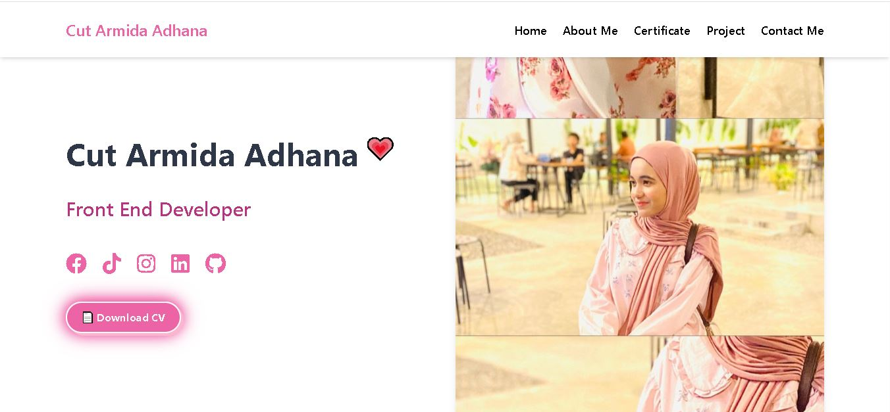

# 🌸 **Cut Armida Adhana's Portfolio** 💻  
### by **Cut Armida Adhana** 💗

Hi there~! Welcome to my **Portfolio Website** ✨  
This is a cute and responsive landing page created with lots of 💕 love and attention to kawaii design! 🌷

## 🍱 **About This Project**  
This is my personal portfolio website, where I showcase my skills, projects, and achievements as a passionate Front-End Developer. Some highlights include:
- Aesthetic pink & orange theme 🎨
- Google Fonts (Dancing Script, Lora, and Poppins) for a lovely typography feel ✍️
- Smooth scroll animation with AOS 🪄
- Fully responsive design — works on all devices 📱💻

## 💖 **Technologies Used**  
- HTML5 + CSS3  
- Bootstrap 4  
- AOS (Animate on Scroll)  
- FontAwesome + RemixIcons  
- GitHub Pages for free hosting  

## 🌐 **Live Demo**  
✨ Check out the live version of my portfolio here:  
https://cutarmidaadhana.github.io/web-portofolio/ 💖

## 📸 **Preview**  
  

## 🧁 **About Me**  
I'm **Cut Armida Adhana**, a passionate Front-End Developer who loves to create beautiful, cute, and meaningful web experiences. 🌸  
I enjoy combining clean code with playful design elements like pastel colors and smooth animations!  

Let’s connect! 💬  
[🌷 Instagram](https://www.instagram.com/ctrmdhn_)  
[🌸 TikTok](https://www.tiktok.com/@cutarmidaadhanaa)  
[🌼 My Portfolio](https://cutarmidaadhana.github.io/web-portofolio/)

---

> 🍡 Built with 💗 by Cut Armida Adhana
